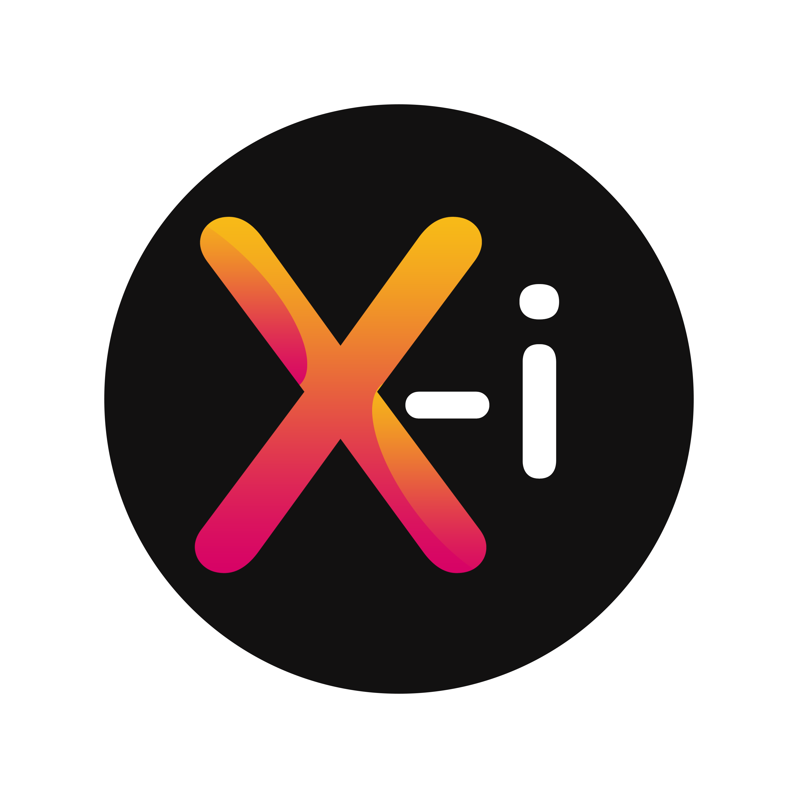

  

***x.css, la performence dans la simplicité***

#Documentation sur x.css

# 1. Les couleurs

## Syntaxe
Couleur d'arrière plan:`
class="couleur"
`
Exemple:

Couleur d'arrière plan lors du survol du curseur de la sourie:`
class="sur-couleur"
`
Exemple:

Couleur de texte:`
class="txt-couleur"
`
Exemple:

Couleur de texte lors du survol du curseur de la sourie:`
class="txt-sur-couleur"
`
Exemple:

## Liste des couleurs:

### Les couleurs de Material Design

|Ordre 1	|Ordre 2	|
|---		|---		|
|Red		|Pink		|
|Purple		|Deep Purple|
|Indigo		|Blue		|
|Cyan		|Amber		|
|Aqua		|Yellow		|
|Teal		|Khaki		|
|Green		|Sand		|		
|Light Green|Lime		|
|Light Blue	|Orange		|
|Deep Orange|Blue Gray	|
|Brown		|Light Gray	|
|Gray		|Dark Gray	|
|Pale Red	|Pale Yellow|
|Pale Green	|Pale-Blue	|

### Les couleurs de Flat UI

### Les couleurs de Windows Metro UI(Microsoft Design Language (MDL))

### Les couleurs de Food UI

### Les couleurs de Window8

